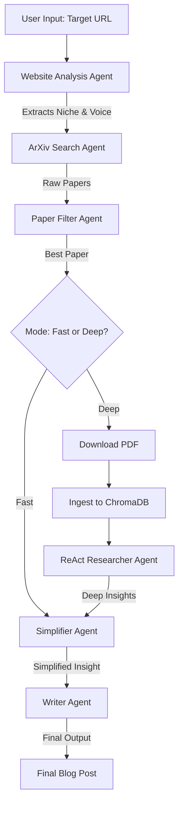

# System Architecture & High-Level Flow

## 1. High-Level Flow

The application functions as a **"Research-to-Content"** pipeline. It automates the process of researching a topic (anchored to a target brand's niche) and converting academic insights into engaging blog content.

## 2. System Architecture

The system is composed of a Decoupled Frontend and a Micro-Service style Backend (though currently monolithic in deployment).

### **Frontend (Client)**
*   **Responsibility**: User Interface for inputting URLs, selecting modes (Fast/Deep), and visualizing results.
*   **Communication**: Sends HTTP POST requests to the backend `/run` endpoint.
*   **State Management**: Handles loading states (`loading`, `processing`, `complete`) and displays real-time feedback (simulated or polled).

### **Backend (Server)**
*   **Core Orchestrator**: Uses **LangGraph** to manage the state machine and agent transitions.
*   **API Layer**: **FastAPI** provides the REST interface.
*   **Agent Swarm**: Each step in the flow is handled by a specialized agent (Python class/function) with a specific prompt and toolset.

### **RAG Engine (Deep Mode)**
*   **Custom Implementation**: A specialized RAG pipeline designed for scientific papers.
*   **Flow**:
    1.  **Ingestion**: Downloads PDF -> Cleans Text -> Recursive Chunking (capturing semantic context).
    2.  **Storage**: Embeds chunks using **Google Gecko (text-embedding-004)** and stores in **ChromaDB**.
    3.  **Retrieval**: **ReAct Agent** queries the vector DB to answer specific research questions before writing.

## 3. Technology Stack

### **Frontend**
*   **Framework**: [React](https://react.dev/)
*   **Build Tool**: [Vite](https://vitejs.dev/)
*   **Styling**: [Tailwind CSS](https://tailwindcss.com/)
*   **Icons**: [Lucide React](https://lucide.dev/)
*   **Animations**: [Framer Motion](https://www.framer.com/motion/)

### **Backend**
*   **Language**: Python 3.9+
*   **API Framework**: [FastAPI](https://fastapi.tiangolo.com/)
*   **Server**: Uvicorn
*   **Orchestration**: [LangGraph](https://python.langchain.com/docs/langgraph) (for stateful multi-agent workflows)
*   **LLM Integration**: [Google Generative AI SDK](https://ai.google.dev/) (Gemini Models)

### **Data & Infrastructure**
*   **Vector Database**: [ChromaDB](https://www.trychroma.com/) (Local embedded)
*   **PDF Processing**: [PyMuPDF (fitz)](https://pymupdf.readthedocs.io/)
*   **External APIs**:
    *   **ArXiv API**: For searching academic papers.
    *   **Google Gemini API**: For LLM generation and Embeddings.
